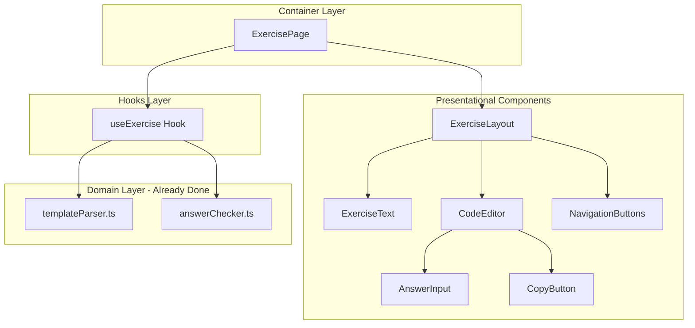
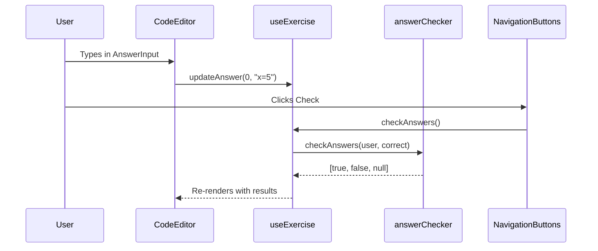

# Exercise Component Refactoring Plan

## Architecture Overview

The recommended pattern is **Custom Hook + Presentational Components**, which maps to backend concepts you're familiar with:

| React Concept | Backend Equivalent |

|---------------|-------------------|

| Custom Hook (`useExercise`) | Service/Controller with state |

| Presentational Component | View/Template |

| Container Component | Thin orchestrator that wires things together |

This approach was chosen over React Context because:

- Context is better for truly global state (auth, theme)
- Custom hooks are more explicit about data flow
- Easier to trace where state comes from when reading code

## Current Problems

1. **ProgramOutput.tsx** duplicates template parsing logic already in `templateParser.ts`
2. **State signaling via boolean** (`needsCheck`) is a code smell - components should not communicate via flag props
3. **Prop drilling** - `setExerciseState` passed down just to be called back up
4. **Mixed concerns** - fetching, state, and rendering all in `Exercise.tsx`

## Proposed Component Hierarchy



## Key Files to Create/Modify

### 1. Create `useExercise` Hook

**File:** [`src/hooks/useExercise.ts`](src/hooks/useExercise.ts) (new)

This hook owns ALL exercise state and exposes actions. Think of it as a "controller" that manages:

- Current step
- User answers for current step  
- Answer validation results
- Exercise state (loading, incomplete, complete, etc.)
```typescript
// Returns shape similar to:
interface UseExerciseReturn {
  // State
  step: number;
  exerciseState: ExerciseState;
  parsedTemplate: ParsedTemplate;
  userAnswers: string[];
  answerResults: AnswerResult[];
  
  // Actions (like controller methods)
  goToNextStep: () => void;
  goToPreviousStep: () => void;
  updateAnswer: (index: number, value: string) => void;
  checkAnswers: () => void;
  submitExercise: () => Promise<void>;
}
```


### 2. Refactor `ProgramOutput` into Smaller Components

Split into focused, testable pieces:

| Component | Responsibility |

|-----------|---------------|

| `CodeEditor` | Renders code with syntax highlighting, places `AnswerInput` slots |

| `AnswerInput` | Single input field with correct/incorrect indicator |

| `CopyButton` | Copy code to clipboard |

### 3. Simplify `Exercise.tsx` (Container)

The container becomes very thin - just wiring:

```typescript
const ExercisePage = ({ user }: { user: User | null }) => {
  const exercise = useExercise({ exerciseId, user });
  
  if (exercise.state === "LOADING") return <Loading />;
  if (exercise.state === "ERROR") return <Error />;
  
  return (
    <ExerciseLayout
      title={exercise.title}
      text={<ExerciseText {...} />}
      code={<CodeEditor {...} />}
      navigation={<NavigationButtons {...} />}
    />
  );
};
```

## Data Flow (No More Prop Drilling)



## File Structure After Refactoring

```
src/
├── domain/                    # Pure business logic (no React)
│   ├── templateParser.ts      ✓ Already done
│   ├── answerChecker.ts       ✓ Already done
│   └── *.test.ts
├── hooks/
│   ├── useExercise.ts         # NEW - all exercise state/logic
│   └── useExerciseCompletion.ts
├── pages/Exercise/
│   ├── Exercise.tsx           # Thin container, uses hook
│   └── components/
│       ├── ExerciseLayout.tsx # Layout structure
│       ├── ExerciseText.tsx   # Keep as-is (already presentational)
│       ├── CodeEditor.tsx     # NEW - replaces ProgramOutput
│       ├── AnswerInput.tsx    # NEW - single input + indicator
│       ├── CopyButton.tsx     # NEW - extracted from ProgramOutput
│       └── NavigationButtons.tsx  # Simplify (remove state logic)
└── services/
    └── exerciseService.ts     # Data fetching (future)
```

## Implementation Order

The refactoring can be done incrementally without breaking the app:

1. Create `useExercise` hook with current state extracted from Exercise.tsx and ProgramOutput.tsx
2. Update Exercise.tsx to use the new hook
3. Split ProgramOutput into CodeEditor, AnswerInput, CopyButton
4. Clean up NavigationButtons to be purely presentational
5. Delete unused code and the `needsCheck` prop drilling pattern